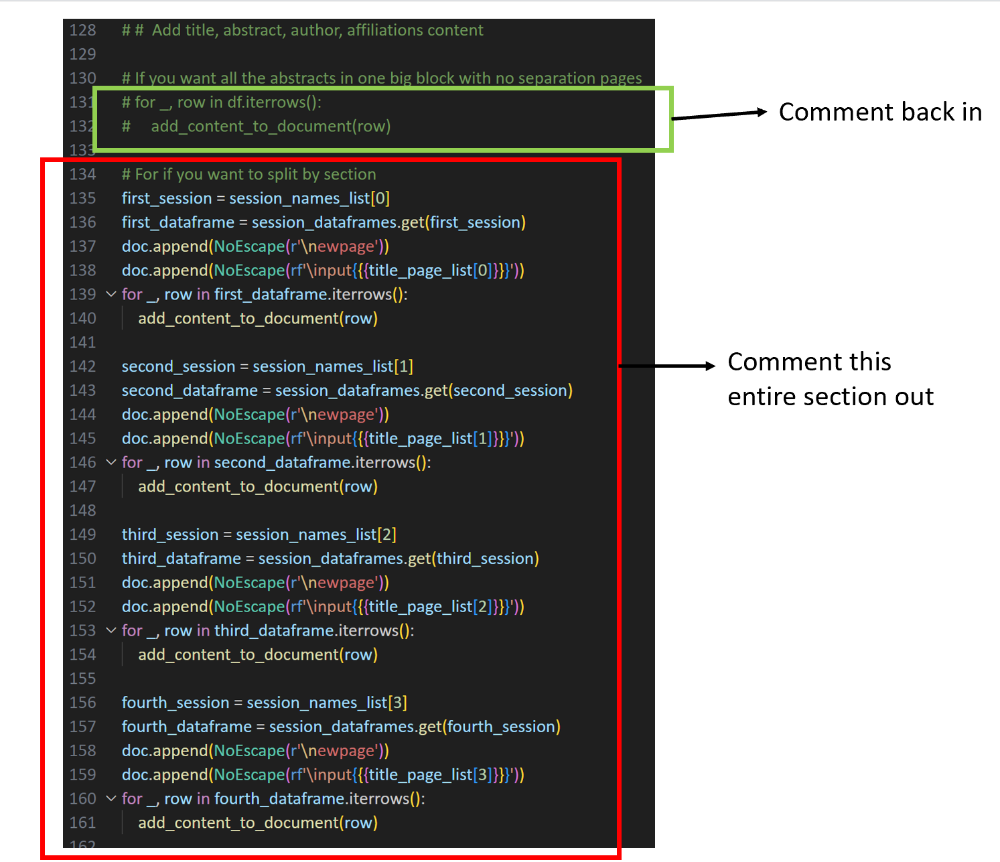

# Create a formatted book of abstracts from an excel file using Python/LaTex. 

## Requirements: 

LaTex  
pandas  
pylatex  
re

## How to use:

The title page (title_page.tex) needs adjusting separately, please add your own graphics/logo, title, venue details etc. 

The input format for the abstract and author information can be .csv or .xlsx.  There is an example file (example_input.csv) which has been used to produce book_of_abstract.pdf. 
You need to ensure text is formatted how you wish it to be presented in the spreadsheet before running the code (for this .xlsx files are probably easier).   
With the current code, the spreadsheet input must have columns for (at least):  
- Title,
- Author(s),
- Affiliation(s),
- Abstract,
- Programme Order, (the numerical order you want the abstracts to display in)
- Session

You also need to input your session_details for the session separator pages. If you don't want to separate by session then just leave this as is, and comment out/in the sections highlighted below: 

You can add as many sessions as required, just make sure to add the equivalent code for section headings etc. 

Running the script will produce both a .tex file and pdf, meaning you can make adjustments to (and re-run) book_of_abstracts.tex  if needed.

